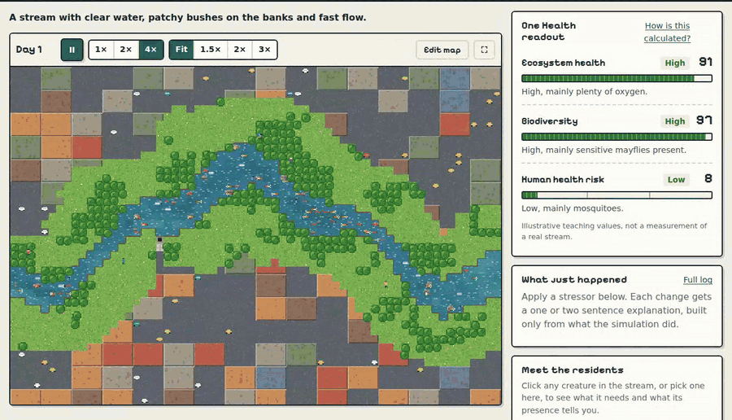
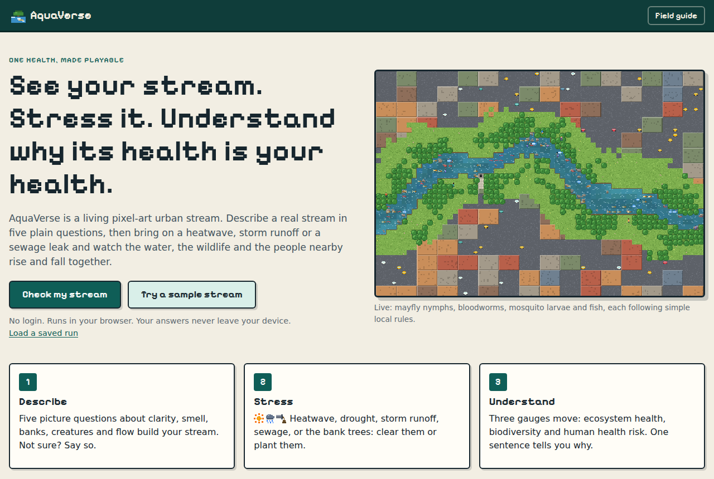
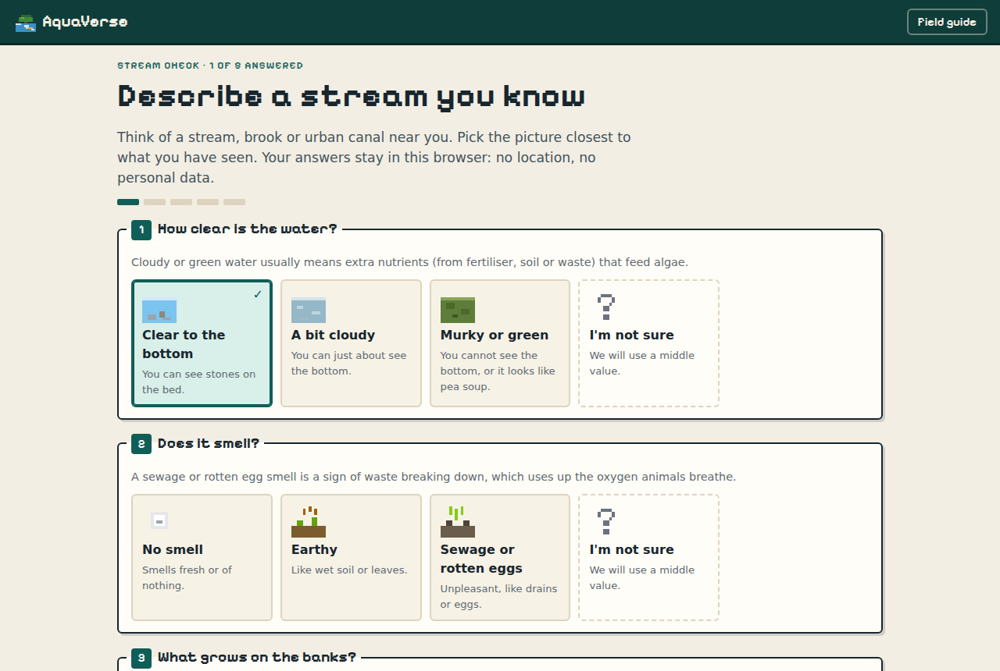
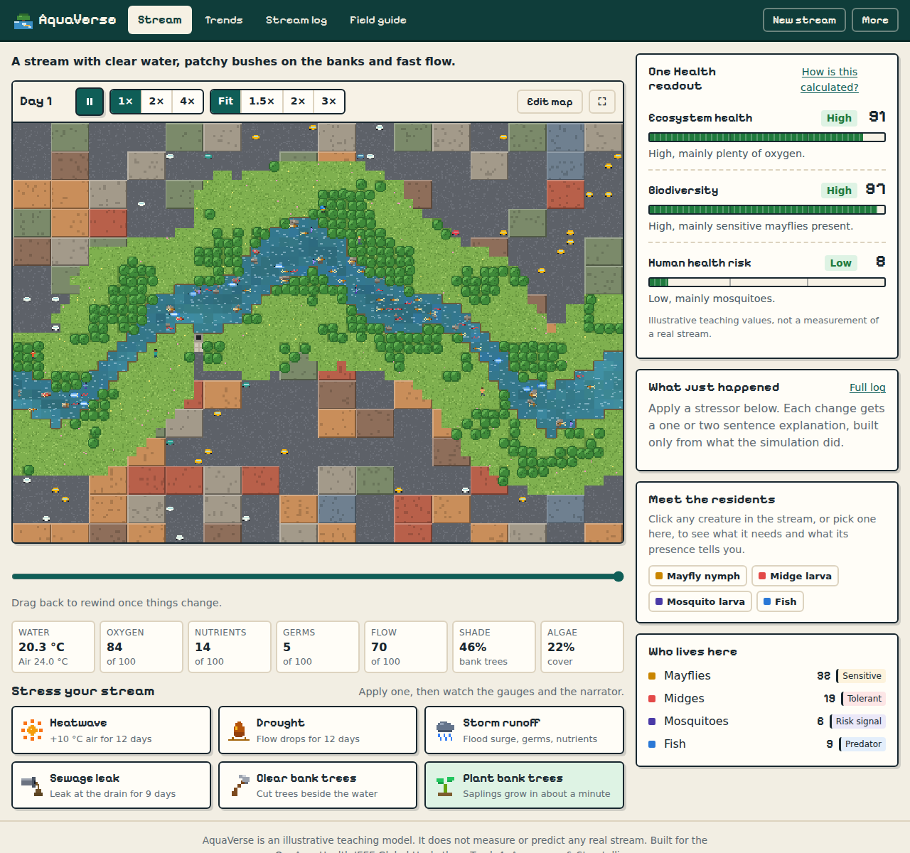
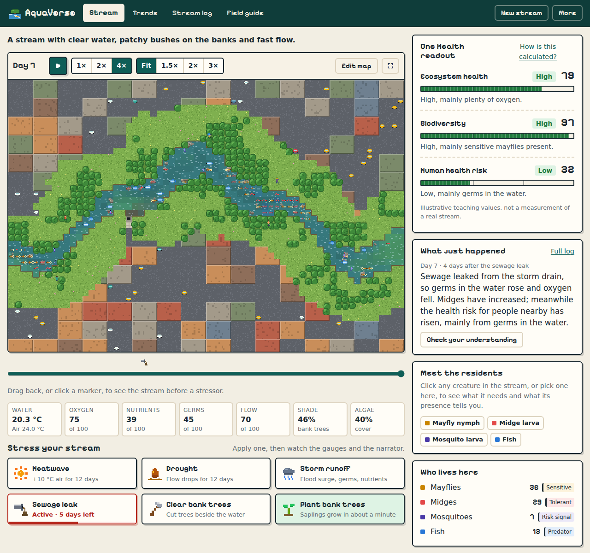
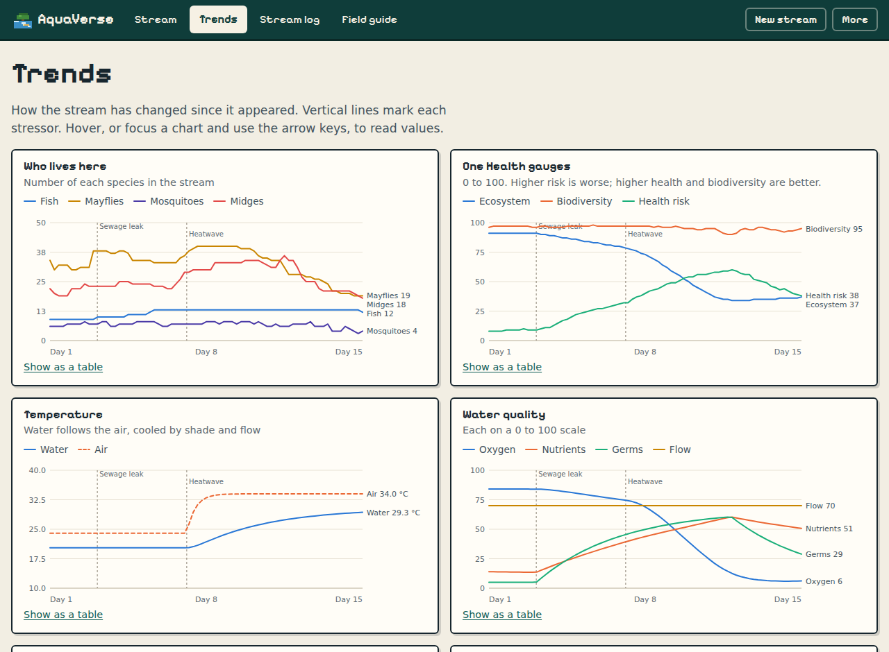
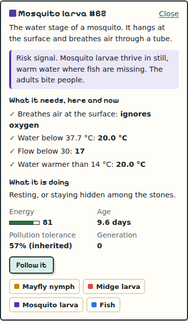
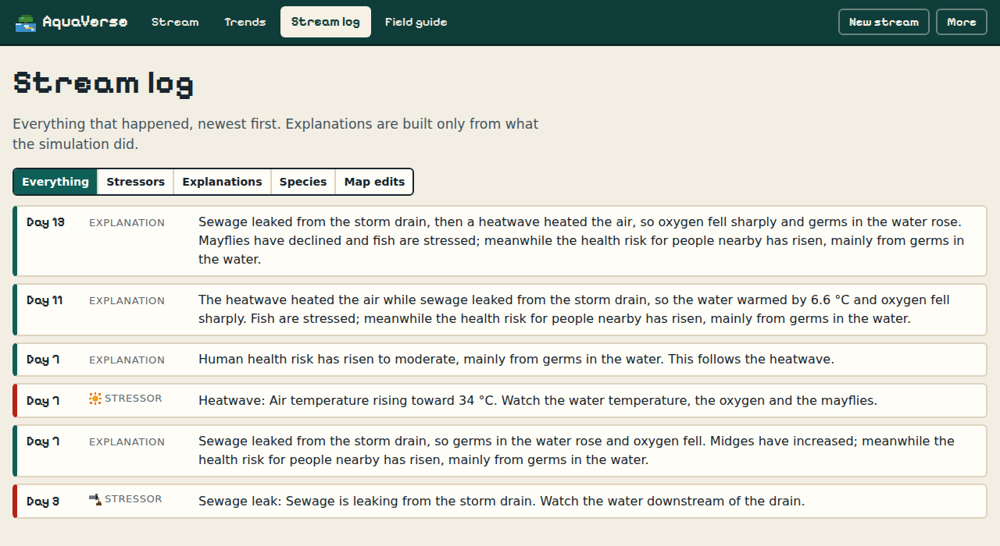
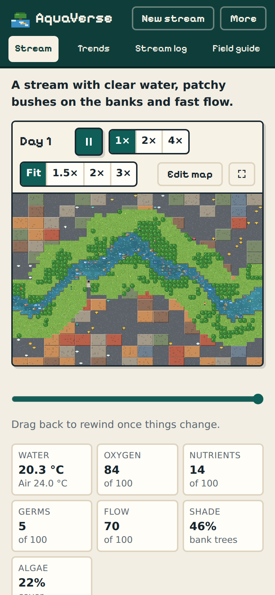

# AquaVerse

**See your stream. Stress it. Understand why its health is your health.**



AquaVerse is a living, pixel-art urban stream that shows how the health of the water, the wildlife and the people nearby rise and fall together. You describe a real stream in five plain questions, AquaVerse builds that stream, and then you apply pressures such as a heatwave, storm runoff or bank clearing and watch the consequences play out.

Built for the **OneAquaHealth IEEE Global Hackathon, Track 4: Awareness & Storytelling**. It also touches Track 1 (plain-language stream assessment) and Track 6 (how a stream responds to climate stress).

> AquaVerse is an illustrative teaching model. Every number in it is a starting value chosen so the simulation is readable on screen, not field data. It does not measure or predict any real stream.

## Screenshots

| Landing | Stream check |
| --- | --- |
|  |  |

**Your stream, live.** Indicator species move through the channel; the gauges, water readout and residents update as it runs.



**After a sewage leak.** The water darkens near the drain, oxygen falls, the health risk gauge rises and the narrator explains the chain.



| Trends | Inspector |
| --- | --- |
|  |  |

| Stream log | On a phone |
| --- | --- |
|  |  |

---

## The problem

People who live beside urban streams rarely connect what they see in the water to their own health. "One Health" is an abstract phrase, stream assessment vocabulary is technical, and the effects of a stressor arrive weeks later and out of sight. Without that connection, people have little reason to monitor a stream or protect it.

## The solution

One loop: **describe, watch, stress, understand.**

1. **Stream check.** Five picture questions: water clarity, smell, bank vegetation, small creatures seen, and flow. Each has an "I'm not sure" option that uses a middle value and says so.
2. **Your stream appears.** A meandering channel runs through a small urban scene. Its starting water, shade and residents come from your answers.
3. **Watch.** Four indicator species live under simple local rules. Click any creature to see what it is, what it needs right now, what it is doing, and what its presence says about the water.
4. **Stress.** Six controls: heatwave, drought, storm runoff, sewage leak, clear bank trees, and plant bank trees (the one positive control).
5. **Understand.** Three gauges move: ecosystem health, biodiversity and human health risk. Each shows a number, a word (low, moderate, high) and its top factor. Below them, the narrator explains the last change as a cause chain:
   > Sewage leaked from the storm drain, so germs in the water rose and oxygen fell. Mayflies have declined and fish are stressed; meanwhile the health risk for people nearby has risen, mainly from germs in the water.
6. **Rewind and compare.** Pause, drag the timeline back (or jump to a stressor marker) to see the stream and gauges as they were, next to the live values.
7. **Go deeper.** Trends charts populations, gauges and water over time. The stream log keeps every event and explanation. The field guide states every rule and its simplification. The map editor lets you redraw water, stones, banks, trees, pavement and storm drains.
8. **Take action.** After the first stressor, a card lists what a resident can do and links to OneAquaHealth.

### The stream

| Species | Role | Needs | Tells you |
| --- | --- | --- | --- |
| Mayfly nymph | Grazes algae | Oxygen above 60, water below 21 °C | Sensitive: present only in clean water |
| Midge larva | Grazes algae and sediment | Oxygen above 20 | Tolerant: survives poor water |
| Mosquito larva | Filters food at the surface | Still water (flow below 30), warmth; ignores oxygen | Risk signal: thrives where fish are gone and water stands still |
| Fish | Eats all three | Oxygen above 40, water below 26 °C | Its loss releases mosquitoes |

The water carries temperature, dissolved oxygen, nutrients, germs, flow, shade and algae. Each creature also inherits a pollution tolerance from its parents, so under long stress the more tolerant survive and pass it on.

| Stressor | Chain to watch |
| --- | --- |
| Heatwave | Warmer water holds less oxygen; mayflies decline and fish are stressed |
| Drought | Still pools form and warm up; mosquito larvae breed |
| Storm runoff | Some creatures are washed away, then extra nutrients feed an algae bloom, then oxygen crashes |
| Sewage leak | Germs and nutrients rise and oxygen falls near the drain; sensitive species vanish there |
| Clear bank trees | Shade and runoff filtering fall; the water warms, algae spreads, a slow decline follows |
| Plant bank trees | Saplings grow over about a minute; shade returns and the stream slowly recovers |

When stressors overlap, the narrator names each one whose effects are part of the change, so it never credits one cause with another's effects.

## Who it is for

| User | What they get |
| --- | --- |
| Resident or citizen scientist | Their own stream on screen, with a plain reading of its health and risks |
| Teacher or outreach worker | A short activity a class can run and discuss, with a field guide behind it and a "check your understanding" question |
| Local decision-maker | A before-and-after anyone can follow, for example why bank planting or runoff control is worth doing |

## Why it matters

- **Impact.** It shows the ecosystem, biodiversity and human health link that One Health is about, using the indicator idea: which organisms are present tells you the water's condition.
- **Engagement.** A playable stream instead of a dashboard or quiz. You cause the change and see the chain of effects.
- **Honesty.** Every outcome on screen traces to a rule written down in the field guide. The narrator only describes facts the simulation produced.
- **Reach.** A static site: no account, no key, no cost per user. Anyone with the link can play. A stream can be shared as a link, or saved and loaded as a file that replays exactly.
- **Privacy.** Answers stay in the browser. No location, no personal data, no analytics.

---

## How it works

```
Browser
├─ React UI (src/ui)
│   Landing · Stream check · Stream view · Trends · Stream log · Field guide
│   Canvas renderer · Inspector · Stressor bar · Gauges · Narrator · Timeline · Map editor
│        │ postMessage (commands)          ▲ snapshots
│        ▼                                 │
└─ Web Worker (src/worker/sim.worker.ts)
    SimulationRuntime (src/engine/runtime.ts)
      ├─ terrain.ts        seeded stream generator, map edits
      ├─ simulation.ts     species, energy, breeding, inherited tolerance
      ├─ stream.ts         water state and stressor effects
      ├─ policy.ts         rule-based decisions (no AI)
      ├─ oneHealth.ts      the three gauges and their top factors
      ├─ narrator.ts       cause-chain sentences from structured facts
      ├─ streamProfile.ts  stream check answers to a starting world
      └─ replay.ts         frames for rewind and scrubbing

Optional server (api/), only when an AI key is set
├─ api/describe.ts   free-text description → the five answers (TypeSafe Jev)
├─ api/check.ts      scores a learner's explanation (TypeSafe Jev)
├─ api/narrate.ts    friendlier wording of the narrator's facts (a very cheap chat model)
└─ api/status.ts     which helpers are available
```

- The engine is separate from the renderer and UI, deterministic and seeded: the same seed, answers and stressor sequence always give the same run.
- Everything runs in the browser. No server is needed for the core product.

## Run it

Requires Node 22.12 or newer.

```bash
npm ci
npm run dev        # http://localhost:5173
```

| Command | What it does |
| --- | --- |
| `npm run dev` | Development server |
| `npm run build` | Typecheck and build the static site into `dist/` |
| `npm run preview` | Serve the built site |
| `npm run build:server` / `npm start` | Build and run the production server used on Render |
| `npm test` | Run the test suite (engine, narrator, replay, performance, API handlers) |
| `npm run check` | Typecheck and test |

## Optional AI helpers

Without a key AquaVerse is fully rule-based and costs nothing to run. With a key from [AI/ML API](https://aimlapi.com), three clearly labelled helpers appear, each with a rule-based fallback:

- **Describe your stream in your own words.** [TypeSafe Jev](https://docs.aimlapi.com/api-references/decision-models/typesafe/jev), a decision model, picks the closest answer to each of the five questions with a probability. Below 50% confidence it uses "I'm not sure". You check every answer before the stream is built.
- **Friendlier narrator wording.** A very cheap chat model (default `amazon/nova-micro-v1`) rewords the rule-based sentence. It receives only the structured facts, may not add numbers, and any reply containing a number the original did not have is thrown away. On any error the original sentence is shown.
- **Check your understanding.** Jev scores the learner's own explanation of what happened.

Copy `.env.example` to `.env` (or set the same variables in your host's settings):

| Variable | Default | Purpose |
| --- | --- | --- |
| `AIMLAPI_KEY` | none | Turns the helpers on. Stays on the server, never sent to the browser. |
| `AIMLAPI_NARRATOR_MODEL` | `amazon/nova-micro-v1` | Chat model used for rewording |
| `AI_DAILY_CALL_LIMIT` | `400` | Upstream calls allowed per day |
| `AI_DISABLED` | unset | Set to `1` to switch every helper off without removing the key |

**Keeping costs down.** Every call is cached by its inputs, rate limited to 12 per minute per visitor and counted against the daily limit. Rewording is capped at 110 output tokens. These guards live in server memory: on Render the single server keeps one count until it restarts, while on a serverless host each running instance keeps its own count and a cold start resets it. With a small balance, set a low `AI_DAILY_CALL_LIMIT` and watch usage on your AI/ML API dashboard, or set `AI_DISABLED=1` to stop all calls at once. Check current rates on the [AI/ML API pricing page](https://aimlapi.com/ai-ml-api-pricing).

## Deploy

**Render.** `render.yaml` is a Render Blueprint: in the Render dashboard choose **New > Blueprint** and pick this repository. It creates one Node web service (free plan) that builds the site, then runs `server/index.ts`, which serves the site and the AI helpers with the same security headers as Vercel. Render asks for `AIMLAPI_KEY` when you create it; leave it empty to run without AI. The blueprint sets `AI_DAILY_CALL_LIMIT` to 100. Free services sleep after a while without visitors, take a few seconds to wake, and a restart resets the in-memory call count.

To run the same server locally:

```bash
npm run build && npm run build:server
npm start          # http://localhost:3000, or set PORT
```

**Vercel.** `vercel.json` builds the static site into `dist/` and serves `api/*.ts` as functions.

Both set a strict content security policy (same-origin scripts, styles and requests only), `nosniff`, `no-referrer` and long-lived caching for hashed assets. Any static host works if you skip the AI helpers: deploy `dist/`.

## Limits

- Real streams hold hundreds of species; AquaVerse has four stand-ins.
- Water chemistry is reduced to a handful of 0 to 100 scores, mostly the same along the whole stream; only pollution entering at the storm drain drifts downstream tile by tile.
- There are no seasons, nights, floods from upstream, groundwater or chemicals other than nutrients and germs.
- Time is compressed: one simulated day passes every 5 seconds at normal speed, and lifespans are shortened to fit.
- Human health risk is a teaching index, not an epidemiological estimate.
- English only.

For a real assessment of a stream near you, contribute observations through the OneAquaHealth citizen science app and talk to your local environment agency.

## Credits

- [OneAquaHealth](https://www.oneaquahealth.eu/): the hackathon and the One Health framing of urban freshwater.
- [AI/ML API](https://aimlapi.com) and [TypeSafe Jev](https://docs.aimlapi.com/api-references/decision-models/typesafe/jev): the optional AI helpers.
- [Pixelify Sans](https://fontsource.org/fonts/pixelify-sans) via Fontsource, under the SIL Open Font License.
